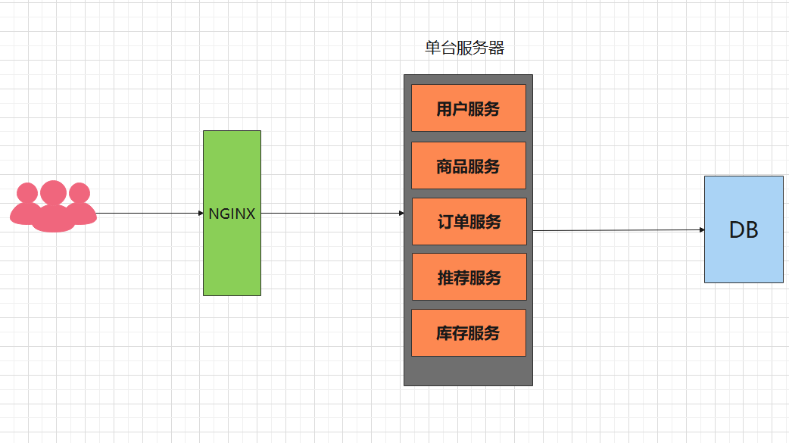
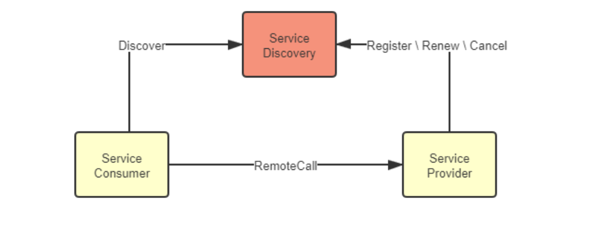
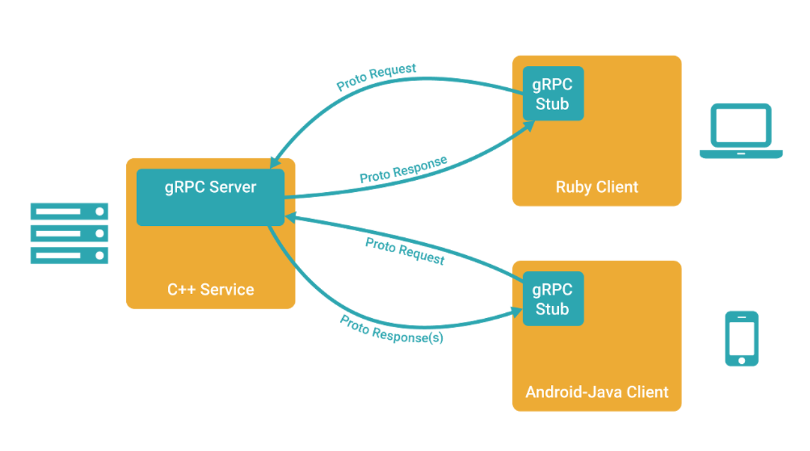
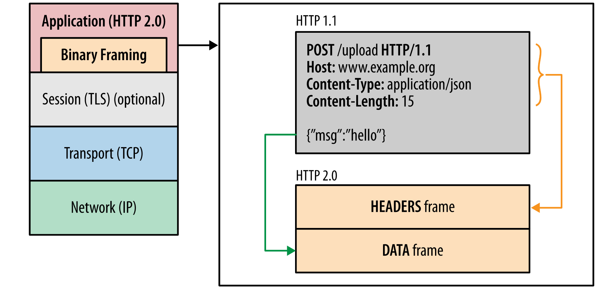

# gRPC教程

## 1. 什么是微服务

### 1.1 单体架构

有一些致命缺点：

1. 一旦某个服务宕机，会引起整个应用不可用，隔离性差
2. 只能整体应用进行伸缩，浪费资源，可伸缩性差
3. 代码耦合在一起，可维护性差

### 1.2 微服务架构

要想解决上述的单体架构的问题，就需要将服务拆分出来，单独管理和维护。

通过上述的架构，解决了单体架构的弊端。

但同时引入了新的问题：

1. 代码冗余
2. 服务和服务之间存在调用关系

#### 1.2.1 代码冗余问题

> 服务未拆分之前，公共的功能有统一的实现，比如认证，授权，限流等，但是服务拆分之后，每一个服务可能都需要实现一遍

解决方案：

1. 由于为了保持对外提供服务的一致性，引入了网关的概念，由网关根据不同的请求，将其转发到不同的服务（路由功能），由于入口的一致性，可以在网关上实现公共的一些功能
2. 可以将公共的功能抽取出来，形成一个新的服务，比如统一认证中心

#### 1.2.2 服务之间调用

服务拆分后，服务和服务之间发生的是进程和进程之间的调用，服务器和服务器之间的调用。

那么就需要发起网络调用，网络调用我们能立马想起的就是http，但是在微服务架构中，http虽然便捷方便，但性能较低，这时候就需要引入RPC（远程过程调用），通过自定义协议发起TCP调用，来加快传输效率。

> 每个服务由于可能分布在成千上百台机器上，服务和服务之间的调用，会出现一些问题，比如，如何知道应该调用哪台机器上的服务，调用方可能需要维护被调用方的地址，这个地址可能很多，增加了额外的负担，这时候就需要引入服务治理.

服务治理中有一个重要的概念`服务发现`，服务发现中有一个重要的概念叫做`注册中心`。

每个服务启动的时候，会将自身的服务和ip注册到注册中心，其他服务调用的时候，只需要向注册中心申请地址即可。

> 当然，服务和服务之间调用会发生一些问题，为了避免产生连锁的雪崩反应，引入了服务容错，为了追踪一个调用所经过的服务，引入了链路追踪，等等这些就构建了一个微服务的生态

## 2. gRPC

> 上面我们讲到，服务和服务之间调用需要使用RPC，`gRPC`是一款**语言中立**、**平台中立**、开源的远程过程调用系统，`gRPC`客户端和服务端可以在多种环境中运行和交互，例如用`java`写一个服务端，可以用`go`语言写客户端调用

数据在进行网络传输的时候，需要进行序列化，序列化协议有很多种，比如xml, json，protobuf等

gRPC默认使用`protocol buffers`，这是google开源的一套成熟的结构数据序列化机制。

在学习gRPC之前，需要先了解`protocol buffers`

**序列化**：将数据结构或对象转换成二进制串的过程。

**反序列化**：将在序列化过程中所产生的二进制串转换成数据结构或对象的过程。

## 3. protobuf

protobuf是谷歌开源的一种数据格式，适合高性能，对响应速度有要求的数据传输场景。因为profobuf是二进制数据格式，需要编码和解码。数据本身不具有可读性。因此只能反序列化之后得到真正可读的数据。  

优势：

1. 序列化后体积相比Json和XML很小，适合网络传输
2. 支持跨平台多语言
3. 消息格式升级和兼容性还不错
4. 序列化反序列化速度很快

### 3.1 安装

- 第一步：下载通用编译器

  地址：https://github.com/protocolbuffers/protobuf/releases

  根据不同的操作系统，下载不同的包，我是windows电脑，解压出来是`protoc.exe`

  

- 第二步：配置环境变量

  

- 第三步：安装go专用的protoc的生成器

~~~go
go get github.com/golang/protobuf/protoc-gen-go
~~~

安装后会在`GOPATH`目录下生成可执行文件，protobuf的编译器插件`protoc-gen-go`，执行`protoc`命令会自动调用这个插件

> 如何使用protobuf呢？

1. 定义了一种源文件，扩展名为 `.proto`，使用这种源文件，可以定义存储类的内容(消息类型)
2. protobuf有自己的编译器 `protoc`，可以将 `.proto` 编译成对应语言的文件，就可以进行使用了

### 3.2 hello world

> 假设，我们现在需要传输用户信息，其中有username和age两个字段

~~~protobuf
// 指定的当前proto语法的版本，有2和3
syntax = "proto3";
//option go_package = "path;name"; ath 表示生成的go文件的存放地址，会自动生成目录的
// name 表示生成的go文件所属的包名
option go_package="../service";
// 指定等会文件生成出来的package
package service;

message User {
  string username = 1;
  int32 age = 2;
}

~~~

**运行protoc命令编译成go中间文件**

~~~go
# 编译user.proto之后输出到service文件夹
protoc --go_out=../service user.proto
~~~

**测试**

~~~go
package main

import (
	"fmt"
	"google.golang.org/protobuf/proto"
	"testProto/service"
)

func main()  {
	user := &service.User{
		Username: "mszlu",
		Age: 20,
	}
	//转换为protobuf
	marshal, err := proto.Marshal(user)
	if err != nil {
		panic(err)
	}
	newUser := &service.User{}
	err = proto.Unmarshal(marshal, newUser)
	if err != nil {
		panic(err)
	}
	fmt.Println(newUser.String())
}

~~~

### 3.3 proto文件介绍

#### 3.3.1 message介绍

`message`：`protobuf`中定义一个消息类型是通过关键字`message`字段指定的。

消息就是需要传输的数据格式的定义。

message关键字类似于C++中的class，Java中的class，go中的struct

例如：

~~~protobuf
message User {
  string username = 1;
  int32 age = 2;
}
~~~

在消息中承载的数据分别对应于每一个字段。

其中每个字段都有一个名字和一种类型  。

#### 3.3.2 字段规则

- `required`:消息体中必填字段，不设置会导致编解码异常。（例如位置1）
- `optional`: 消息体中可选字段。（例如位置2）
- `repeated`: 消息体中可重复字段，重复的值的顺序会被保留（例如位置3）在go中重复的会被定义为切片。

~~~protobuf
message User {
  string username = 1;
  int32 age = 2;
  optional string password = 3;
  repeated string address = 4;
}
~~~

#### 3.3.3 字段映射

| **.proto Type** | **Notes**                                                    | **C++ Type** | **Python Type** | **Go Type** |
| --------------- | ------------------------------------------------------------ | ------------ | --------------- | ----------- |
| double          |                                                              | double       | float           | float64     |
| float           |                                                              | float        | float           | float32     |
| int32           | 使用变长编码，对于负值的效率很低，如果你的域有 可能有负值，请使用sint64替代 | int32        | int             | int32       |
| uint32          | 使用变长编码                                                 | uint32       | int/long        | uint32      |
| uint64          | 使用变长编码                                                 | uint64       | int/long        | uint64      |
| sint32          | 使用变长编码，这些编码在负值时比int32高效的多                | int32        | int             | int32       |
| sint64          | 使用变长编码，有符号的整型值。编码时比通常的 int64高效。     | int64        | int/long        | int64       |
| fixed32         | 总是4个字节，如果数值总是比总是比228大的话，这 个类型会比uint32高效。 | uint32       | int             | uint32      |
| fixed64         | 总是8个字节，如果数值总是比总是比256大的话，这 个类型会比uint64高效。 | uint64       | int/long        | uint64      |
| sfixed32        | 总是4个字节                                                  | int32        | int             | int32       |
| sfixed32        | 总是4个字节                                                  | int32        | int             | int32       |
| sfixed64        | 总是8个字节                                                  | int64        | int/long        | int64       |
| bool            |                                                              | bool         | bool            | bool        |
| string          | 一个字符串必须是UTF-8编码或者7-bit ASCII编码的文 本。        | string       | str/unicode     | string      |
| bytes           | 可能包含任意顺序的字节数据。                                 | string       | str             | []byte      |

#### 3.3.4 默认值

protobuf3 删除了 protobuf2 中用来设置默认值的 default 关键字，取而代之的是protobuf3为各类型定义的默认值，也就是约定的默认值，如下表所示：

| 类型     | 默认值                                                       |
| :------- | :----------------------------------------------------------- |
| bool     | false                                                        |
| 整型     | 0                                                            |
| string   | 空字符串""                                                   |
| 枚举enum | 第一个枚举元素的值，因为Protobuf3强制要求第一个枚举元素的值必须是0，所以枚举的默认值就是0； |
| message  | 不是null，而是DEFAULT_INSTANCE                               |

#### 3.3.5 标识号

`标识号`：在消息体的定义中，每个字段都必须要有一个唯一的标识号，标识号是[0,2^29-1]范围内的一个整数。

~~~protobuf
message Person { 

  string name = 1;  // (位置1)
  int32 id = 2;  
  optional string email = 3;  
  repeated string phones = 4; // (位置4)
}
~~~

以Person为例，name=1，id=2, email=3, phones=4 中的1-4就是标识号。

#### 3.3.6 定义多个消息类型

一个proto文件中可以定义多个消息类型

~~~go
message UserRequest {
  string username = 1;
  int32 age = 2;
  optional string password = 3;
  repeated string address = 4;
}

message UserResponse {
  string username = 1;
  int32 age = 2;
  optional string password = 3;
  repeated string address = 4;
}
~~~

#### 3.3.7 嵌套消息

可以在其他消息类型中定义、使用消息类型，在下面的例子中，Person消息就定义在PersonInfo消息内，如  ：

~~~protobuf
message PersonInfo {
    message Person {
        string name = 1;
        int32 height = 2;
        repeated int32 weight = 3;
    } 
	repeated Person info = 1;
}
~~~

如果你想在它的父消息类型的外部重用这个消息类型，你需要以PersonInfo.Person的形式使用它，如：  

~~~protobuf
message PersonMessage {
	PersonInfo.Person info = 1;
}
~~~

当然，你也可以将消息嵌套任意多层，如 :

~~~protobuf
message Grandpa { // Level 0
    message Father { // Level 1
        message son { // Level 2
            string name = 1;
            int32 age = 2;
    	}
	} 
    message Uncle { // Level 1
        message Son { // Level 2
            string name = 1;
            int32 age = 2;
        }
    }
}
~~~

#### 3.3.8 定义服务(Service)

如果想要将消息类型用在RPC系统中，可以在.proto文件中定义一个RPC服务接口，protocol buffer 编译器将会根据所选择的不同语言生成服务接口代码及存根。

~~~protobuf
service SearchService {
	//rpc 服务的函数名 （传入参数）返回（返回参数）
	rpc Search (SearchRequest) returns (SearchResponse);
}
~~~

上述代表表示，定义了一个RPC服务，该方法接收SearchRequest返回SearchResponse

## 4. gRPC实例

### 4.1 RPC和gRPC介绍

RPC（Remote Procedure Call）远程过程调用协议，一种通过网络从远程计算机上请求服务，而不需要了解底层网络技术的协议。RPC它假定某些协议的存在，例如TCP/UDP等，为通信程序之间携带信息数据。在OSI网络七层模型中，RPC跨越了传输层和应用层，RPC使得开发包括网络分布式多程序在内的应用程序更加容易。

过程是什么？ 过程就是业务处理、计算任务，更直白的说，就是程序，就是像调用本地方法一样调用远程的过程

RPC采用客户端/服务端的模式，通过request-response消息模式实现

gRPC 里*客户端*应用可以像调用本地对象一样直接调用另一台不同的机器上*服务端*应用的方法，使得您能够更容易地创建分布式应用和服务。与许多 RPC 系统类似，gRPC 也是基于以下理念：定义一个*服务*，指定其能够被远程调用的方法（包含参数和返回类型）。在服务端实现这个接口，并运行一个 gRPC 服务器来处理客户端调用。在客户端拥有一个*存根*能够像服务端一样的方法。

官方网站：https://grpc.io/

底层协议：

* HTTP2: https://github.com/grpc/grpc/blob/master/doc/PROTOCOL-HTTP2.md
* GRPC-WEB ： https://github.com/grpc/grpc/blob/master/doc/PROTOCOL-WEB.md

#### 4.1.1 HTTP2

- HTTP/1里的header对应HTTP/2里的 HEADERS frame
- HTTP/1里的payload对应HTTP/2里的 DATA frame

gGRPC把元数据放到HTTP/2 Headers里，请求参数序列化之后放到 DATA frame里

**基于HTTP/2 协议的优点**

1. 公开标准
2. HTTP/2的前身是Google的[SPDY](https://en.wikipedia.org/wiki/SPDY) ，有经过实践检验
3. HTTP/2 天然支持物联网、手机、浏览器
4. 基于HTTP/2 多语言客户端实现容易
   1. 每个流行的编程语言都会有成熟的HTTP/2 Client
   2. HTTP/2 Client是经过充分测试，可靠的
   3. 用Client发送HTTP/2请求的难度远低于用socket发送数据包/解析数据包
5. HTTP/2支持Stream和流控
6. 基于HTTP/2 在Gateway/Proxy很容易支持
   1. nginx和envoy都有支持
7. HTTP/2 安全性有保证
   1. HTTP/2 天然支持SSL，当然gRPC可以跑在clear text协议（即不加密）上。
   2. 很多私有协议的rpc可能自己包装了一层TLS支持，使用起来也非常复杂。开发者是否有足够的安全知识？使用者是否配置对了？运维者是否能正确理解？
   3. HTTP/2 在公有网络上的传输上有保证。比如这个[CRIME攻击](https://en.wikipedia.org/wiki/CRIME)，私有协议很难保证没有这样子的漏洞。
8. HTTP/2 鉴权成熟
   1. 从HTTP/1发展起来的鉴权系统已经很成熟了，可以无缝用在HTTP/2上
   2. 可以从前端到后端完全打通的鉴权，不需要做任何转换适配

**基于HTTP/2 协议的缺点**

- rpc的元数据的传输不够高效

  尽管HPAC可以压缩HTTP Header，但是对于rpc来说，确定一个函数调用，可以简化为一个int，只要两端去协商过一次，后面直接查表就可以了，不需要像HPAC那样编码解码。
  可以考虑专门对gRPC做一个优化过的HTTP/2解析器，减少一些通用的处理，感觉可以提升性能。

- HTTP/2 里一次gRPC调用需要解码两次

  一次是HEADERS frame，一次是DATA frame。

- HTTP/2 标准本身是只有一个TCP连接，但是实际在gRPC里是会有多个TCP连接，使用时需要注意。

gRPC选择基于HTTP/2，那么它的性能肯定不会是最顶尖的。但是对于rpc来说中庸的qps可以接受，通用和兼容性才是最重要的事情。

- 官方的benchmark：https://grpc.io/docs/guides/benchmarking.html
- https://github.com/hank-whu/rpc-benchmark

gRPC目前是k8s生态里的事实标准，而Kubernetes又是容器编排的事实标准。gRPC已经广泛应用于Istio体系，包括:

- Envoy与Pilot(现在叫istiod)间的XDS协议
- mixer的handler扩展协议
- MCP(控制面的配置分发协议)

在Cloud Native的潮流下，开放互通的需求必然会产生基于HTTP/2的RPC。

### 4.2 实例

#### 4.2.1 服务端

~~~go
// 这个就是protobuf的中间文件

// 指定的当前proto语法的版本，有2和3
syntax = "proto3";
option go_package="../service";

// 指定等会文件生成出来的package
package service;

// 定义request model
message ProductRequest{
	int32 prod_id = 1; // 1代表顺序
}

// 定义response model
message ProductResponse{
	int32 prod_stock = 1; // 1代表顺序
}

// 定义服务主体
service ProdService{
    // 定义方法
    rpc GetProductStock(ProductRequest) returns(ProductResponse);
}
~~~

生成：

~~~shell
protoc --go_out=plugins=grpc:./ .\product.proto
~~~

服务端：

~~~go
import "google.golang.org/grpc"

func main()  {
	server := grpc.NewServer()
	service.RegisterProdServiceServer(server,service.ProductService)

	listener, err := net.Listen("tcp", ":8002")
	if err != nil {
		log.Fatal("服务监听端口失败", err)
	}
	_ = server.Serve(listener)
}

~~~

#### 4.2.2 客户端

新建client目录，把上述生成的product.pb.go copy过来

~~~go

func main()  {
	// 1. 新建连接，端口是服务端开放的8002端口
	// 没有证书会报错
	conn, err := grpc.Dial(":8002", grpc.WithTransportCredentials(insecure.NewCredentials()))
	if err != nil {
		log.Fatal(err)
	}

	// 退出时关闭链接
	defer conn.Close()

	// 2. 调用Product.pb.go中的NewProdServiceClient方法
	productServiceClient := service.NewProdServiceClient(conn)

	// 3. 直接像调用本地方法一样调用GetProductStock方法
	resp, err := productServiceClient.GetProductStock(context.Background(), &service.ProductRequest{ProdId: 233})
	if err != nil {
		log.Fatal("调用gRPC方法错误: ", err)
	}

	fmt.Println("调用gRPC方法成功，ProdStock = ", resp.ProdStock)
}

~~~

